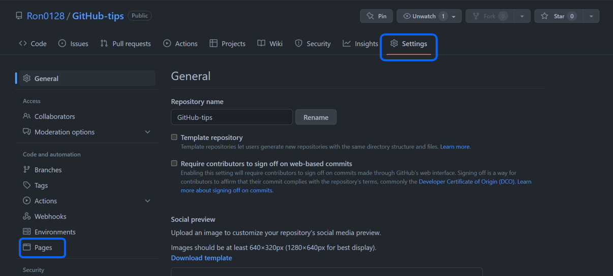

```{r setup, include=FALSE}
knitr::opts_chunk$set(
	echo = TRUE,
	fig.height = 8,
	fig.width = 8,
	message = FALSE,
	warning = FALSE)
```

GitHubでコードとhtmlを公開する方法

# 初めてリポジトリを作成するとき

## GitHubの設定

1. [GitHub](https://github.co.jp/)でアカウントを作成


2. RepositoriesのNewをクリック


3. Repository nameにリポジトリ名を入力


4. 公開する場合はPublic（公開しない場合はPrivateに変更）


5. スクロールしてCreate repositoryをクリック


6. HTTPSをコピー


## RStudioの設定

7. RStudioを起動してProjectをクリック


8. New Projectをクリック


9. Version Controlをクリック


10. Gitをクリック


11. Repository URLに6でコピーしたHTTPSをペースト


12. New Fileのアイコンをクリック


13. R Markdownをクリック


14. R Markdownのタイトルを入力してOKをクリック


15. Save current documentのアイコンをクリック


16. ファイル名にindexと入力してSaveをクリック


17. New Folderをクリック


18. new folder name にdocsと入力してOKをクリック


19. Knitをクリック（Filesにindex.htmlができる）


20. index.htmlにチェックを入れてMoreをクリックしMoveをクリック


21. docsを選択してOpenをクリック


22. GitをクリックしてCommitをクリック


23. 必要なファイルにチェックを入れる（Ctrl + Aを押しながらチェックを入れれば全部選択）


24. Commit messageに説明を入力（first, correctedなど）してCommitをクリック


25. Pushをクリック


## GitHubの設定

26. SettingsをクリックしてPagesをクリック



27. SourceのBranchをNoneからmasterに変更（ここではmainに名前を変更している）


28. SourceのSelect folderを/(root)から/docsに変更してSaveをクリック


29. URLをコピー


30. リポジトリのホーム画面に戻って歯車のアイコンをクリック


31. Websiteに28でコピーしたURLをペーストしてSave changesをクリック


## 完成

htmlのリンクがつきました


htmlが開けるようになりました


# リポジトリを更新するとき

## RStudioの設定

32. 20，21の手順でindex.htmlをdocsに移動（index.htmlはdocsに入らず作成される）

33. 22～25を実行